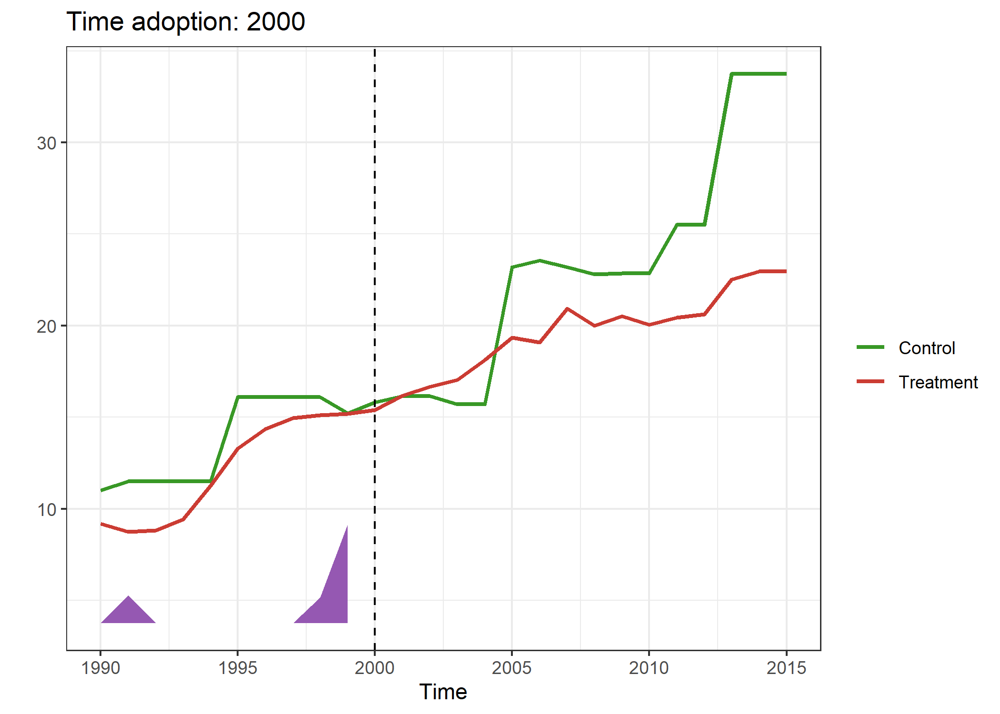

<!-- README.md is generated from README.Rmd. Please edit that file -->

# *Staggered* Synthdid (`Ssynthdid`)

## Overview

Adaptation of the
[Synthdid](https://github.com/synth-inference/synthdid/tree/master)
library for staggered panel data, with ease of entering covariates.

## Installation

``` r
# Development version from GitHUB
# install.remotes("remotes")
remotes::install_github("tjhon/ssynthdid")
```

## Usage

``` r
library(Ssynthdid)
library(ggplot2)
```

### Example data `Quota`

``` r
quota_df <- quota()
print(head(quota_df))
#> # A tibble: 6 × 6
#>   womparl lnmmrt country  year quota lngdp
#>     <dbl>  <dbl> <chr>   <dbl> <dbl> <dbl>
#> 1   28.8    4.26 Albania  1990     0  8.46
#> 2    3.60   4.23 Albania  1991     0  8.12
#> 3    5.70   4.17 Albania  1992     0  8.05
#> 4    5.70   4.14 Albania  1993     0  8.14
#> 5    5.70   3.89 Albania  1994     0  8.23
#> 6    5.70   3.97 Albania  1995     0  8.36
estimate <- ssynth_estimate(quota_df, "country", "year", "quota", "womparl")
```

``` r
estimate |> dplyr::glimpse()
#> List of 3
#>  $ att_estimate: num 8.03
#>  $ att_table   : tibble [7 × 11] (S3: tbl_df/tbl/data.frame)
#>   ..$ time        : num [1:7] 2000 2002 2003 2005 2010 ...
#>   ..$ tau         : num [1:7] 8.39 6.97 13.95 -3.45 2.75 ...
#>   ..$ tau_wt      : num [1:7] 16 28 26 11 6 4 3
#>   ..$ weighted_tau: num [1:7] 1.428 2.075 3.859 -0.404 0.175 ...
#>   ..$ N0          : int [1:7] 110 110 110 110 110 110 110
#>   ..$ T0          : num [1:7] 10 12 13 15 20 22 23
#>   ..$ N1          : int [1:7] 1 2 2 1 1 1 1
#>   ..$ T1          : num [1:7] 16 14 13 11 6 4 3
#>   ..$ weights_sdid:List of 7
#>   ..$ Y_beta      :List of 7
#>   ..$ Units       :List of 7
#>  $ data_ref    : tibble [3,094 × 7] (S3: tbl_df/tbl/data.frame)
#>   ..$ unit     : chr [1:3094] "Albania" "Angola" "Argentina" "Armenia" ...
#>   ..$ time     : num [1:3094] 1990 1990 1990 1990 1990 1990 1990 1990 1990 1990 ...
#>   ..$ treatment: num [1:3094] 0 0 0 0 0 0 0 0 0 0 ...
#>   ..$ outcome  : num [1:3094] 28.8 14.5 6.3 35.6 6.1 ...
#>   ..$ treated  : num [1:3094] 0 0 0 0 0 0 0 0 0 0 ...
#>   ..$ ty       : num [1:3094] 0 0 0 0 0 0 0 0 0 0 ...
#>   ..$ tyear    : num [1:3094] 0 0 0 0 0 0 0 0 0 0 ...
```

`att_estimate`

``` r
estimate$att_estimate
#> [1] 8.034102
```

Time information

``` r
estimate$att_table
#> # A tibble: 7 × 11
#>    time    tau tau_wt weighted_tau    N0    T0    N1    T1 weights_sdid Y_beta  
#>   <dbl>  <dbl>  <dbl>        <dbl> <int> <dbl> <int> <dbl> <list>       <list>  
#> 1  2000  8.39      16       1.43     110    10     1    16 <named list> <dbl[…]>
#> 2  2002  6.97      28       2.08     110    12     2    14 <named list> <dbl[…]>
#> 3  2003 14.0       26       3.86     110    13     2    13 <named list> <dbl[…]>
#> 4  2005 -3.45      11      -0.404    110    15     1    11 <named list> <dbl[…]>
#> 5  2010  2.75       6       0.175    110    20     1     6 <named list> <dbl[…]>
#> 6  2012 21.8        4       0.926    110    22     1     4 <named list> <dbl[…]>
#> 7  2013 -0.820      3      -0.0262   110    23     1     3 <named list> <dbl[…]>
#> # ℹ 1 more variable: Units <list>
```

## Plots

### Trajectory

`plot_estimate$time_{time}`

``` r
plt_estimate <- estimate |> ssynthdid_plot()
plt_estimate$time_2000
```

<!-- -->

### Weights

`plot_estimate$time_{time}`

``` r
plt_estimate_wg <- estimate |> ssynthdid_units_plot()
plt_estimate_wg$time_2000
```

<!-- -->
